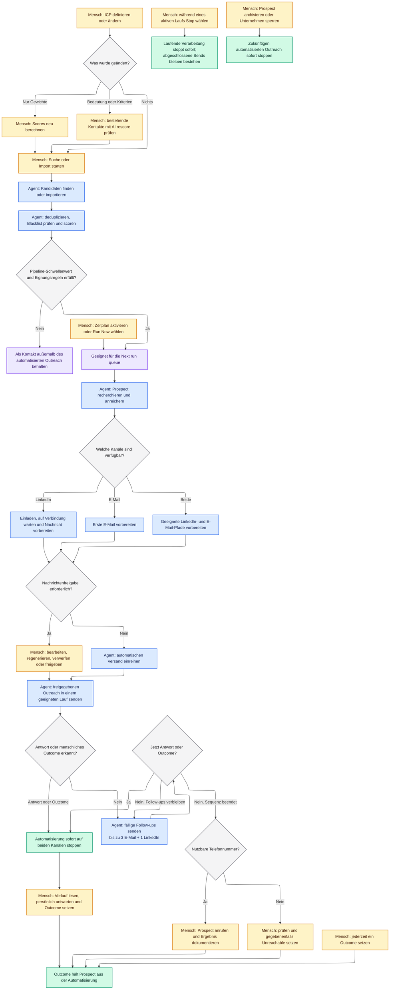

import { SalesAgentFlow } from "/snippets/sales-agent-flow.jsx";

Der Sales Agent führt jeden Kontakt durch abgesicherte Schritte. Du entscheidest, wen du ansprichst und wann die Arbeit beginnt. Der Agent recherchiert und sendet geeigneten Outreach. Eine Antwort oder ein menschliches Outcome übergibt die Kontrolle an dich und stoppt die Automatisierung sofort.

<Info>
  Die interaktive Auswahl erklärt, wie Konfiguration den Pfad verändert. Sie liest und ändert keine Kontodaten. Reale Einstellungen änderst du im [Sales-Agent-Dashboard](https://sales.keinsaas.com).
</Info>

## Pipeline-Konfiguration ausprobieren

<SalesAgentFlow language="de" />

## Vollständiger kommentierter Ablauf

Das Diagramm zeigt alle Hauptzweige einschließlich optionaler Freigabe und der beiden menschlichen Übergaben nach dem Outreach.

## Wo du eingreifst

| Moment | Deine Aktion | Nächster Schritt des Agenten |
| --- | --- | --- |
| **ICP-Einrichtung oder -Änderung** | Targeting, Ausschlüsse, Gewichte oder Schwellenwerte bearbeiten. Bestehende Scores bei Aufforderung aktualisieren. | Nutzt den aktuellen Score und Schwellenwert für neue Kandidaten und deren zukünftige Queue-Eignung. |
| **Suche oder Import** | Sales-Navigator-Quelle starten, CSV hochladen oder bei bestehenden Unternehmen suchen. | Findet Kandidaten, filtert, dedupliziert und vergibt Scores. Credits gelten für gefundene Such- oder Anreicherungsergebnisse, nicht nur für endgültige Treffer. |
| **Start des Laufs** | Zeitplan des Seats aktivieren oder **Run Now** wählen. | Beansprucht nur aktuell geeignete Arbeit innerhalb der Tageslimits des Seats. |
| **Nachrichtenprüfung, wenn aktiviert** | Entwurf bearbeiten, regenerieren, verwerfen oder freigeben. | Sendet eine freigegebene Nachricht erst in einem geeigneten Lauf; die Freigabe selbst sendet nicht. |
| **Antwort** | Vollständigen Verlauf lesen, persönlich antworten und passendes Outcome setzen. | Stoppt automatisierte Follow-ups auf E-Mail und LinkedIn sofort. |
| **Keine Antwort nach Follow-ups** | Prospects unter **To Call** mit vorhandener Telefonnummer bearbeiten; sonst prüfen, ob **Unreachable** passt. | Lässt die digitale Sequenz beendet, sobald die konfigurierten Follow-ups ausgeschöpft sind. |
| **Vertriebsfortschritt** | **Meeting**, **Offer Sent**, **Closed Deal**, **Not interesting**, **Lost Deal** oder **Unreachable** setzen. | Entfernt den Prospect sofort aus allen automatisierten Claims. |

## Optionale Pfade

<AccordionGroup>
  <Accordion title="Freigabe an oder aus">
    Bei aktivierter Freigabe warten erstellte E-Mail- und LinkedIn-Nachrichten unter **Messages** auf deine Prüfung. Beim automatischen Versand entfällt der Freigabeschritt, du bleibst aber für den generierten Inhalt verantwortlich.
  </Accordion>
  <Accordion title="Geplante oder manuelle Läufe">
    Ein Zeitplan startet an den konfigurierten Tagen zur gewählten Zeit einen vollständigen Lauf. **Run Now** startet dieselbe abgesicherte Pipeline bei Bedarf. Erweiterte Läufe können bei Messages, Outreach oder Follow-ups beginnen, ohne Eignungsprüfungen zu umgehen.
  </Accordion>
  <Accordion title="LinkedIn, E-Mail oder beides">
    Du kannst LinkedIn für einen Seat deaktivieren, während E-Mail weiterläuft. Sind beide Kanäle verfügbar, nutzt der Agent jeden Pfad entsprechend deinen Einstellungen. Eine Antwort auf einem Kanal stoppt Follow-ups auf beiden.
  </Accordion>
  <Accordion title="Follow-ups und telefonische Übergabe">
    Setze die Follow-up-Anzahl eines Kanals auf `0`, um die Schleife zu entfernen. Das unterstützte Maximum beträgt drei E-Mail-Follow-ups plus ein LinkedIn-Follow-up. Nach Ende der Sequenz erscheinen Prospects mit nutzbarer Telefonnummer für einen menschlichen Call.
  </Accordion>
</AccordionGroup>

<Warning>
  **Stages sind Fakten, keine Steuerung.** Du verschiebst einen Prospect nicht von **Invite Sent** zu **Connected** oder **Messaged**. Setze ein menschliches [Outcome](/de/operate/stages-and-outcomes), wenn sich die Vertriebssituation ändert. Jedes Outcome stoppt Outreach sofort.
</Warning>

<CardGroup cols={3}>
  <Card title="Targeting konfigurieren" icon="target" href="/de/configure/icp-and-scoring">
    Definiere ICP, Score-Gewichte und Pipeline-Schwellenwert.
  </Card>
  <Card title="Lauf konfigurieren" icon="calendar-clock" href="/de/configure/schedule-and-limits">
    Wähle Kanäle, Freigaben, Follow-ups, Zeitpläne und Limits.
  </Card>
  <Card title="Übergaben bearbeiten" icon="handshake" href="/de/operate/replies-and-handoff">
    Übernimm Antworten und arbeite die menschliche Call-Queue ab.
  </Card>
</CardGroup>
