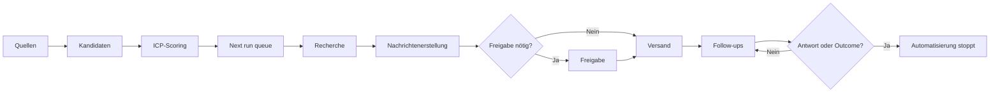

Der Sales Agent besteht aus einer Abfolge abgesicherter Schritte. Ein Kontakt kommt nur weiter, wenn die nötigen Informationen für den nächsten Schritt vorliegen und keine Stoppbedingung greift.

## Die fünf Steuerungsebenen

### 1. Quellen bestimmen, wer aufgenommen werden kann

Du kannst Sales-Navigator-Suchen oder -Listen bereitstellen, eine CSV importieren oder bei bereits im Dashboard vorhandenen Unternehmen nach Kontakten suchen. Die Blacklist wird geprüft, bevor neue Personen aufgenommen werden.

### 2. Targeting bestimmt, wer geeignet ist

Der Agent bewertet Kandidaten anhand deines Ideal Customer Profile (ICP). Strukturierte Kriterien und relative Gewichtungen ergeben einen Score von 0 bis 100. Der Pipeline-Schwellenwert kann Kontakte mit niedrigem Score von der Ansprache ausschließen.

Ein Suchergebnis ist keine Garantie für ICP-Fit. Der Agent muss unter Umständen mehr Kandidaten prüfen, um Personen zu finden, die granulare Filter erfüllen.

### 3. Seat-Einstellungen bestimmen die Ausführung

Jeder Seat hat einen eigenen Owner, verbundene Konten, einen Zeitplan, eine Kanalauswahl und Tageslimits. Kundenweite Regeln steuern Follow-up-Anzahlen, Freigaben, den Umgang mit inaktiven Profilen und das gemeinsame Messaging-Playbook.

### 4. Queue-Regeln bestimmen den nächsten Schritt

Die Karten unter **Next run** zeigen Kontakte, die aktuell für Kontaktanfragen, Nachrichtenerstellung, Outreach und kanalspezifische Follow-ups geeignet sind. Jede Karte berücksichtigt das relevante Tageslimit.

### 5. Antworten und Outcomes stoppen die Automatisierung

Eine erkannte Antwort auf einem der beiden Kanäle stoppt Follow-ups kanalübergreifend. Du kannst außerdem ein Outcome wie **Meeting**, **Offer Sent** oder **Not Interested** setzen. Jedes Outcome entfernt den Prospect aus der automatisierten Verarbeitung.

<Note>
  Pipeline-Stages werden aus aufgezeichneten Aktivitäten abgeleitet. Du verschiebst einen Prospect nicht manuell von **Invited** zu **Connected** oder **Messaged**. Wenn menschliche Beurteilung nötig ist, setzt du ein [Outcome](/de/operate/stages-and-outcomes).
</Note>

## So arbeiten die Kanäle zusammen

Du kannst LinkedIn und E-Mail gemeinsam nutzen, LinkedIn für einen Seat deaktivieren oder E-Mail priorisieren und LinkedIn danach einsetzen. Wenn ein LinkedIn-Pfad nicht verfügbar ist, kann ein geeigneter E-Mail-Pfad fortgesetzt werden. Eine Antwort auf einem der Kanäle beendet die automatisierte Sequenz.

In der [Referenz der Pipeline-Stages](/de/reference/pipeline-stages) findest du alle im Dashboard angezeigten Bezeichnungen.
