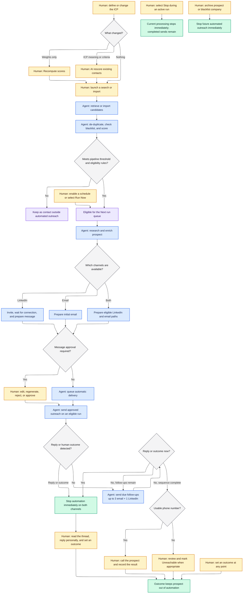

import { SalesAgentFlow } from "/snippets/sales-agent-flow.jsx";

The Sales Agent moves each contact through guarded steps. You decide who to target and when work starts. The agent researches, prepares, and sends eligible outreach. A reply or human outcome hands control back to you and stops automation immediately.

<Info>
  The interactive controls below explain how configuration changes the path. They do not read or update your account. Change real settings in the [Sales Agent dashboard](https://sales.keinsaas.com).
</Info>

## Try a pipeline configuration

<SalesAgentFlow language="en" />

## Complete annotated flow

This diagram shows every main branch, including optional approval and the two human handoffs after outreach.

## Where you intervene

| Moment | Your action | What the agent does next |
| --- | --- | --- |
| **ICP setup or change** | Edit targeting, exclusions, weights, or thresholds. Refresh existing scores when prompted. | Uses the current score and threshold for new candidates and future queue eligibility. |
| **Search or import** | Launch a Sales Navigator source, upload a CSV, or search at existing companies. | Retrieves candidates, applies filters, de-duplicates, and scores. Credits apply to found search or enrichment results, not only final matches. |
| **Run start** | Enable the seat schedule or select **Run Now**. | Claims only currently eligible work within the seat's daily limits. |
| **Message review, when enabled** | Edit, regenerate, reject, or approve the draft. | Sends an approved message only on an eligible run; approval itself does not send. |
| **Reply** | Read the complete thread, reply personally, and set the appropriate outcome. | Stops automated follow-ups on email and LinkedIn immediately. |
| **No reply after follow-ups** | Work prospects in **To Call** when a phone number is available; otherwise review whether **Unreachable** is appropriate. | Leaves the digital sequence stopped once its configured follow-ups are exhausted. |
| **Sales progress** | Set **Meeting**, **Offer Sent**, **Closed Deal**, **Not interesting**, **Lost Deal**, or **Unreachable**. | Removes the prospect from every automated claim immediately. |

## Optional paths

<AccordionGroup>
  <Accordion title="Approval on or off">
    With approval on, generated email and LinkedIn messages wait for your review in **Messages**. With automatic delivery on, the approval step disappears, but you remain responsible for the generated content.
  </Accordion>
  <Accordion title="Scheduled or manual runs">
    A schedule starts a complete run on the configured days and time. **Run Now** starts the same guarded pipeline on demand. Advanced runs can start at Messages, Outreach, or Follow-ups without bypassing eligibility checks.
  </Accordion>
  <Accordion title="LinkedIn, email, or both">
    You can turn LinkedIn off for a seat while email continues. When both channels are available, the agent uses each path according to your settings. A reply on either channel stops follow-ups on both.
  </Accordion>
  <Accordion title="Follow-ups and phone handoff">
    Set a channel's follow-up count to `0` to remove that loop. The supported maximum is three email follow-ups plus one LinkedIn follow-up. After the sequence is exhausted, prospects with a usable phone number surface for a human call.
  </Accordion>
</AccordionGroup>

<Warning>
  **Stages are facts, not controls.** You do not drag a prospect from **Invite Sent** to **Connected** or **Messaged**. Set a human [outcome](/operate/stages-and-outcomes) when the sales situation changes. Any outcome stops outreach immediately.
</Warning>

<CardGroup cols={3}>
  <Card title="Configure targeting" icon="target" href="/configure/icp-and-scoring">
    Define the ICP, scoring weights, and pipeline threshold.
  </Card>
  <Card title="Configure the run" icon="calendar-clock" href="/configure/schedule-and-limits">
    Choose channels, approvals, follow-ups, schedules, and limits.
  </Card>
  <Card title="Handle handoffs" icon="handshake" href="/operate/replies-and-handoff">
    Take over replies and work the human call queue.
  </Card>
</CardGroup>
