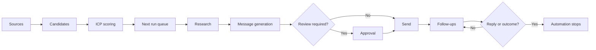

The Sales Agent is a sequence of guarded steps. A contact advances only when the facts needed for the next step exist and no stop condition applies.

## The five control layers

### 1. Sources decide who can enter

You can supply Sales Navigator searches or lists, import a CSV, or search for contacts at companies already in the dashboard. The blacklist is checked before new people are accepted.

### 2. Targeting decides who is eligible

The agent evaluates candidates against your ideal customer profile. Structured criteria and relative weights produce a 0–100 score. The pipeline threshold can hold low-scoring contacts outside outreach.

A search result is not a promise of ICP fit. The agent may need to inspect more candidates to find the people who satisfy granular filters.

### 3. Per-seat settings decide how work is performed

Each seat has its own owner, connected accounts, schedule, channel choice, and daily action limits. Client-wide rules control follow-up counts, approvals, inactive-profile handling, and the shared messaging playbook.

### 4. Queue rules decide what happens next

The **Next run** cards show contacts currently eligible for connection requests, message generation, outreach, and channel-specific follow-ups. Each card applies the relevant daily limit.

### 5. Replies and outcomes stop automation

A detected reply on either channel stops follow-ups across both channels. A person can also set an outcome such as **Meeting**, **Offer Sent**, or **Not Interested**. Every outcome removes the prospect from automated work.

<Note>
  Pipeline stages are derived from recorded activity. You do not manually move a prospect from **Invited** to **Connected** or **Messaged**. You set an [outcome](/operate/stages-and-outcomes) when human judgment is required.
</Note>

## Channels work together

You can run LinkedIn and email together, turn LinkedIn off for a seat, or prioritize email while LinkedIn follows afterward. If a LinkedIn path becomes unavailable, an eligible email path can continue. A reply on either channel closes the automated sequence.

Read the [pipeline stage reference](/reference/pipeline-stages) for every label shown in the dashboard.
